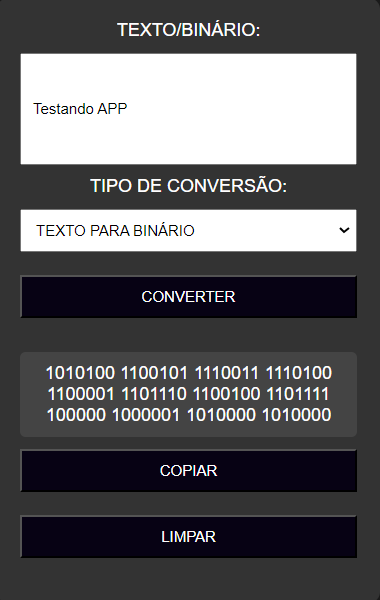

# TEXTO E BINARIO
🧑‍💻CONVERTA TEXTO PARA BINARIO E BINARIO PARA TEXTO!

   
  

## DESCRIÇÃO:
O projeto "TEXTO E BINÁRIO" oferece uma ferramenta para converter texto em binário ou binário em texto. Aqui estão as principais funcionalidades implementadas:

1. **Conversão de Texto para Binário:**
   - Permite ao usuário inserir texto no campo de entrada.
   - Selecionando "TEXTO PARA BINÁRIO" no menu suspenso e clicando em "CONVERTER", o texto inserido é convertido em sua representação binária.

2. **Conversão de Binário para Texto:**
   - Permite ao usuário inserir sequência de binários no campo de entrada.
   - Selecionando "BINÁRIO PARA TEXTO" no menu suspenso e clicando em "CONVERTER", os binários inseridos são convertidos em texto.

3. **Copiar Resultado:**
   - Após a conversão, o usuário pode clicar em "COPIAR" para copiar o resultado para a área de transferência.
   - Uma mensagem de confirmação é exibida temporariamente para indicar que o texto foi copiado com sucesso.

4. **Limpar Campos:**
   - Ao clicar em "LIMPAR", todos os campos são limpos e o resultado da conversão é removido.

## EXECUTANDO O PROJETO:
1. **Inserir Texto/Binário:**
   - Digite ou cole o texto ou sequência de binários que deseja converter no campo de entrada.

2. **Selecionar Tipo de Conversão:**
   - Escolha entre "TEXTO PARA BINÁRIO" ou "BINÁRIO PARA TEXTO" no menu suspenso.

3. **Converter:**
   - Clique no botão "CONVERTER" para realizar a conversão de acordo com o tipo selecionado.
   - O resultado será exibido abaixo do botão "CONVERTER".

4. **Copiar o Resultado:**
   - Após a conversão, clique no botão "COPIAR" para copiar o resultado para a área de transferência.
   - Uma mensagem de confirmação será exibida temporariamente para indicar que o texto foi copiado com sucesso.

5. **Limpar Campos:**
   - Se desejar limpar os campos de entrada e o resultado da conversão, clique em "LIMPAR".

## NÃO SABE?
- Entendemos que para manipular arquivos em `HTML`, `CSS` e outras linguagens relacionadas, é necessário possuir conhecimento nessas áreas. Para auxiliar nesse aprendizado, oferecemos cursos gratuitos disponíveis:
* [CURSO DE HTML E CSS](https://github.com/VILHALVA/CURSO-DE-HTML-E-CSS)
* [CURSO DE JAVASCRIPT](https://github.com/VILHALVA/CURSO-DE-JAVASCRIPT)
* [CONFIRA MAIS CURSOS](https://github.com/VILHALVA?tab=repositories&q=+topic:CURSO)

## CREDITOS:
- [PROJETO CRIADO PELO VILHALVA](https://github.com/VILHALVA)
- [ESTÁ DISPONIVEL NO SITE](https://vilhalva.github.io/STYLER/STYLER.html)